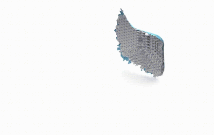

# TetGAN [[Project  Page](https://threedle.github.io/tetGAN/)]

This repository contains code from the paper [TetGAN: A Convolutional Neural Network for Tetrahedral Mesh Generation](https://arxiv.org/abs/2210.05735). The proposed neural network layers learn deep features over each tetrahedron and learn to extract patterns within spatial regions across multiple scales. We illustrate the capabilities of our technique to encode tetrahedral meshes into a semantically meaningful latent-space which can be used for shape editing and synthesis.

## Installation
Install all dependencies using [anaconda](https://www.anaconda.com/) and the `env.yml` file provided.

    conda env create -f env.yml
    conda activate tetGAN

## Data
To train TetGAN, we need files specifying the meshes in the dataset and an initial tetrahedral grid.

### Tetrahedral Grid Files
We generate tetrahedral grids by passing a unit cube (with corners at (0, 0, 0) and (1, 1, 1)) to [quartet](https://github.com/crawforddoran/quartet). We have provided examples of these grids in `tetGAN/grids`. Each file is named `cube_{p}.tet` where `p` specifies a resolution parameter passed to quartet.

### Mesh Data
There are two options regarding mesh data:

1. You may download our preprocessed data (coming soon)
2. You may provide a directory of mesh files to our preprocessing script.

### Preprocessed Data
We provide preprocessed data on various ShapeNet categories. Upload coming soon.

### Build Your Own Data
You may build your own dataset through the following:

1. Create a directory containing all of the training meshes.

        training_data
        |- 000.obj
        |- 001.obj
        |- 002.obj
        |- ...

2. Pass this directory to the `main` script in `src/data.py`, also specifying an initial grid file and a subdivision depth.

**IMPORTANT NOTE:** The routine we use to compute occupancies requires that input meshes be watertight and manifold. We use the [Watertight Manifold repository](https://github.com/hjwdzh/Manifold) to preprocess ShapeNet objects. The accuracy of the occupancy labels is **not** guaranteed for non-manifold shapes.

The processed data comes in the form of a folder containing 3 pickled tensors per mesh file. 

        processed_data
        |- 000
        |-|- occ.pt
        |-|- def.pt
        |-|- def_c.pt
        |- ...
## Training
To train a model, use `src/main.py` which accepts a config file as well as command-line arguments. We have provided an example config used to produce our paper results: `configs/example_config.yml`. Any arguments specified by the config file will be overriden by command-line arguments. 

    # Train with example config on processed data
    python src/main.py --config configs/example_config.yml --dataset_path ./data/processed_data

    # Train with example config, but change the number of epochs and batch size
    python src/main.py --config configs/example_config.yml --num_epochs 200 --batch_size 15

    # Train with example config, but alter the training resolution by changing the initial grid and the subdivision depth
    python src/main.py --config configs/example_config.yml --initial_grid ./grids/cube_0.25.tet --subdivision_depth 4

## Inference and Mesh Extraction
To perform inference, one may either sample from the latent distribution or encode and decode a shape. Here, we provide an example code snippet of these operations.

    # The variable vae is a trained network
    # Sample a latent code and decode it

    dist = torch.distributions.normal.Normal(0.0, 1.0)
    sample = dist.sample(sample_shape=(1, cfg['code_size']))
    decoded = vae.decode(sample)

    # Encode and decode a shape
    # The variable feat are the occupancies and centroid deformations computed for the mesh

    encoded = vae.encode(feat.unsqueeze(0))[0]
    decoded = vae.decode(encoded)

    # You may now use the encoding for latent operations such as arithmetic/interpolation

    encoded_1 = vae.encode(feat_1.unsqueeze(0))[0]
    decoded = vae.decode((encoded + encoded_1) / 2)
    
To extract a mesh from network output, refer to the function `extract_mesh` in `src/nets.py`. Calling this function with a network and some output generates either a `TriangleMesh` or a `TetMesh` object which then may be written to file through their respective I/O functions.

    # Extract mesh from network output
    extracted_surface = vae.extract_mesh(decoded, 'triangle', dataset.deformation_scalar, smoothing_iterations=2)
    extracted_volume = vae.extract_mesh(decoded, 'tetrahedral', dataset.deformation_scakar, smoothing_iterations=2)

# Citation

    @inproceedings{tetGAN,
        title = {TetGAN: A Convolutional Neural Network for Tetrahedral Mesh Generation},
        author = {Gao, Wang, Metzer, Yeh, Hanocka},
        booktitle = {Proceedings British Machine Vision Conference (BMVC)},
        year = {2022}
    }

# Questions / Issues
If you have questions or issues regarding this code, please open an issue.
